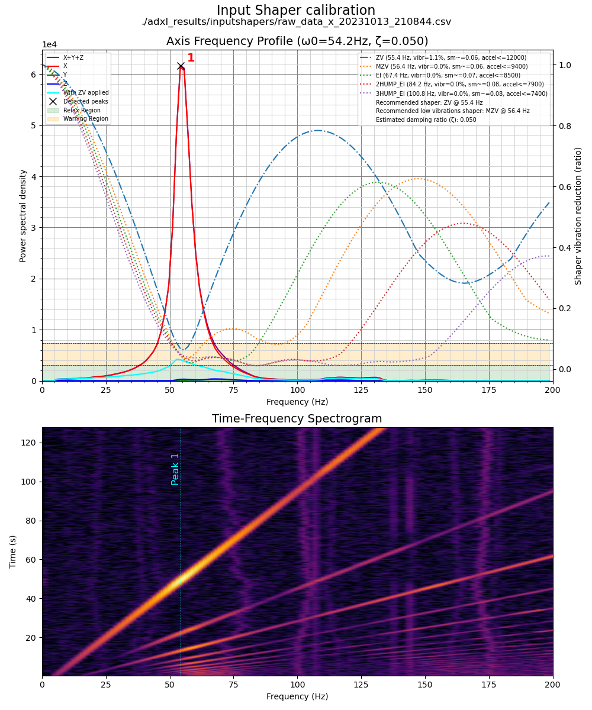
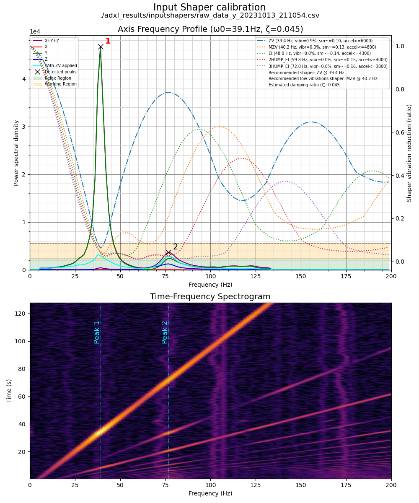

# Klippain Shake&Tune Module

This Klippain "Shake&Tune" repository is a standalone module from the [Klippain](https://github.com/Frix-x/klippain) ecosystem, designed to automate and calibrate the input shaper system on your Klipper 3D printer with a streamlined workflow and insightful vizualisations.


It operates in two steps:

  1. Utilizing specially tailored Klipper macros, it initiates tests on either the belts or the printer X/Y axis to measure the machine axes behavior. This is basically an automated call to the Klipper `TEST_RESONANCES` macro with custom parameters.
  
  2. Then a custom Python script is called to: 
     1. Generate insightful and improved graphs, aiding in parameter tuning for the Klipper `[input_shaper]` system (including best shaper choice, resonant frequency and damping ratio) or diagnosing and rectifying mechanical issues (like belt tension, defective bearings, etc..)
     2. Relocates the graphs and associated CSV files to your Klipper config folder for easy access via Mainsail/Fluidd to eliminate the need for SSH.
     3. Manages the folder by retaining only the most recent results (default setting of keeping the latest three sets).

If needed, refer to [my IS graphs documentation](./docs/input_shaper.md) for tips on interpreting the generated graphs.

| Belts graphs | X graphs | Y graphs | Vibrations measurement |
|:----------------:|:------------:|:------------:|:---------------------:|
|  |  |  |  |

## Installation

For those not using the full [Klippain](https://github.com/Frix-x/klippain), follow these steps to integrate this Shake&Tune module in your setup:
  1. Run the install script over SSH on your printer:
     ```bash
     wget -O - https://raw.githubusercontent.com/Frix-x/klippain-shaketune/main/install.sh | bash
     ```
  2. Append the following to your `printer.cfg` file:
     ```
     [include K-ShakeTune/*.cfg]
     ```
  3. If you want to get automatic updates, add the following to your `moonraker.cfg` file:
     ```
     [update_manager Klippain-ShakeTune]
     type: git_repo
     path: ~/klippain_shaketune
     channel: beta
     origin: https://github.com/Frix-x/klippain-shaketune.git
     primary_branch: main
     managed_services: klipper
     install_script: install.sh
     ```

## Usage

Ensure your machine is homed, then invoke one of the following macros as needed:
  - `BELTS_SHAPER_CALIBRATION` for belt resonance graphs, useful for verifying belt tension and differential belt paths behavior.
  - `AXES_SHAPER_CALIBRATION` for input shaper graphs to mitigate ringing/ghosting by tuning Klipper's `[input_shaper]` system.
  - `VIBRATIONS_CALIBRATION` for machine vibration graphs to optimize your slicer speed profiles.
  - `EXCITATE_AXIS_AT_FREQ` to sustain a specific excitation frequency, useful to let you inspect and find out what is resonating.

Retrieve the results from the results folder, accessible directly via Mainsail/Fluidd WebUI. For further insight on reading the results, refer to my documentation on [interpreting the IS graphs](./docs/input_shaper.md).
