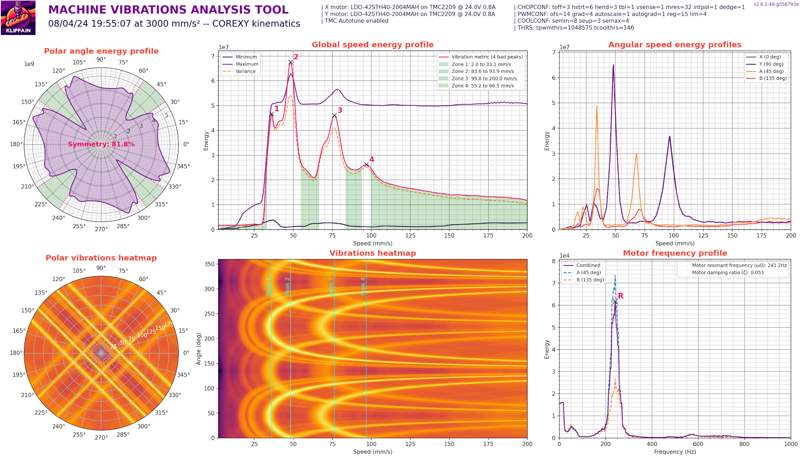

# Klippain Input Shaper standalone module

This standalone Klippain module is the best way to automate and calibrate the input shaper sytem on your machine with a streamlined workflow. It's a two part system and here is how it works:
  1. Using specialy tailored Klipper macros, it first run either some tests for the belts or for the printer X/Y axis. The goal is to measure the machine axes behavior using an ADXL345 hooked to your machine toolhead.
  2. Then, it automatically call some Python scripts that automate a few things:
     1. it generate some custom made graphs that should give you all the insights of what is happenning in your machine. The goal is to get the best set of parameters for the Klipper `[input_shaper]` system (including best shaper choice, resonant frequency and damping ratio), or diagnose and fix the mechanical problems like belt tension, etc...
     2. it then move the graphs and associated CSVs files to your Klipper config folder to allow you to find them directly using Mainsail/Fluidd (no more SSH is needed to calibrate your input shaper!)
     3. it manage the folder to delete the older files and keep only a set (default is three) of the most recent results.

  > **Note**
  >
  > This input shaper workflow module is part of the [Klippain](https://github.com/Frix-x/klippain) ecosystem. If you're already using a full Klippain installation on your machine, this is still directly included and nothing more need to be installed to use it!

When you have your graphs, you can get some hints on how to read and interpret them in [my IS graphs documentation](./docs/input_shaper.md).

| Belts resonances example | X resonances example | Y resonances example | Vibrations measurement example |
|:------------------------:|:--------------------:|:--------------------:|:------------------------------:|
|  |  |  |  |


## Installation

If you're not using the full Klippain, here are the steps to install it in your own config:
  1. Add the [is_workflow folder](./../../scripts/is_workflow/) at the root of your own config (ie. in your `~/printer_data/config/` directory).
  2. Be sure to have the `gcode_shell_command.py` Klipper extension installed. Easiest way to install it is to use the advanced section of KIAUH.
  3. Make the scripts executable using SSH. When in the folder (`cd ~/printer_data/config/is_workflow/scripts`), use:

     ```bash
     chmod +x ./is_workflow.py
     chmod +x ./graph_belts.py
     chmod +x ./graph_shaper.py
     chmod +x ./graph_vibrations.py
     ```

  4. Add the following at the end of your `printer.cfg` file:
     ```
     [include is_workflow/*.cfg]
     ```


## Usage

Be sure your machine is homed and then call one of the following macros:
  - `BELTS_SHAPER_CALIBRATION` to get the belt resonnance graphs. This is usefull to verify the belts tension, but also to check if the belt paths are OK.
  - `AXES_SHAPER_CALIBRATION` to get the input shaper graphs and suppress the ringing/ghosting artefacts in your prints by setting correctly Klipper's [input_shaper] system.
  - `VIBRATIONS_CALIBRATION` to get the machine vibrations graphs and select the best speeds for your slicer profile.
  - `EXCITATE_AXIS_AT_FREQ` to maintain a specific excitation frequency in order to let you inspect and find out what is resonating.

Then, look for the results in the results folder. You can find them directly in your config folder by using the WebUI of Mainsail/Fluidd. You can get some hints on the results in my documentation about how to [read and interpret the IS graphs](./docs/input_shaper.md).
