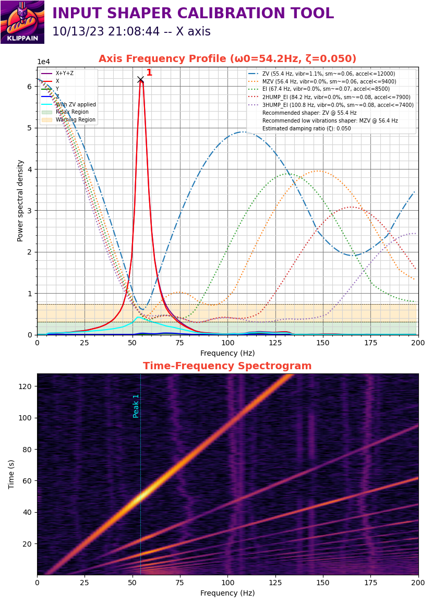

# Klippain Shake&Tune module documentation


## Resonance testing

First, check out the **[input shaping and tuning generalities](./is_tuning_generalities.md)** documentation to understand how it all works and what to look for when taking these measurements.

Then look at the documentation for each type of graph by clicking on them below tu run the tests and better understand your results to tune your machine!

| [Belt response comparison](./macros/belts_tuning.md) | [Axis input shaper graphs](./macros/axis_tuning.md) | [Vibrations profile](./macros/vibrations_profile.md) |
|:----------------:|:------------:|:---------------------:|
| [](./macros/belts_tuning.md) | [](./macros/axis_tuning.md) | [](./macros/vibrations_profile.md) |


## Additional macros

### AXES_MAP_CALIBRATION (experimental)

All graphs generated by this package show plots based on accelerometer measurements, typically labeled with the X, Y, and Z axes. It's important to note that if the accelerometer is rotated, its axes may not align correctly with the machine axes, making the plots more difficult to interpret, analyze, and understand. The `AXES_MAP_CALIBRATION` is designed to automatically measure the alignement of the accelerometer in order to set it correctly.

  > **Note**:
  >
  > This misalignment doesn't affect the measurements because the total sum across all axes is used to set the input shaper filters. It's just an optional but convenient way to configure Klipper's `[adxl345]` (or whichever accelerometer you have) "axes_map" parameter.

Here are the parameters available when calling this macro:

| parameters | default value | description |
|-----------:|---------------|-------------|
|Z_HEIGHT|20|z height to put the toolhead before starting the movements. Be careful, if your accelerometer is mounted under the nozzle, increase it to avoid crashing it on the bed of the machine|
|SPEED|80|speed of the toolhead in mm/s for the movements|
|ACCEL|1500 (or max printer accel)|accel in mm/s^2 used for all the moves|
|TRAVEL_SPEED|120|speed in mm/s used for all the travels moves|
|ACCEL_CHIP|"adxl345"|accelerometer chip name in the config|

The machine will move slightly in +X, +Y, and +Z, and output in the console: `Detected axes_map: -z,y,x`.

Use this value in your `printer.cfg` config file:
```
[adxl345] # replace "adxl345" by your correct accelerometer name
axes_map: -z,y,x
```

### EXCITATE_AXIS_AT_FREQ

The `EXCITATE_AXIS_AT_FREQ` macro is particularly useful for troubleshooting mechanical vibrations or resonance issues. This macro allows you to maintain a specific excitation frequency for a set duration, enabling hands-on diagnostics. By touching different components during the excitation, you can identify the source of the vibration, as contact usually stops it.

Here are the parameters available when calling this macro:

| parameters | default value | description |
|-----------:|---------------|-------------|
|FREQUENCY|25|excitation frequency (in Hz) that you want to maintain. Usually, it's the frequency of a peak on one of the graphs|
|TIME|10|time in second to maintain this excitation|
|AXIS|x|axis you want to excitate. Can be set to either "x", "y", "a", "b"|


## Complementary ressources

  - [Sineos post](https://klipper.discourse.group/t/interpreting-the-input-shaper-graphs/9879) in the Klipper knowledge base
