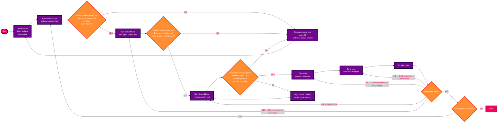

# Klippain Shake&Tune module documentation


When perfecting 3D prints and tuning your printer, there is all that resonance testing stuff that Shake&Tune will try to help you with. But keep in mind that it's part of a complete process, and Shake&Tune alone won't magically make your printer print at lightning speed. Also, when using the tools, **it's important to get back to the original need: good prints**.

While there are some ideal goals described in this documentation, you need to understand that it's not always possible to achieve the ideal resonance graphs due to a variety of factors unique to each printer, such as precision of the assembly, quality and brand of components, components wear, etc. Even a different accelerometer can give different results. But that's not a problem; the primary goal is to produce clean and satisfactory prints. If your test prints look good and meet your standards, even if the response curves aren't perfect, you're on the right track. **Trust your printer and your print results more than chasing ideal graphs!** If it's satisfactory, there's no need for further adjustments.

First, you might want to check out the **[input shaping and tuning generalities](./is_tuning_generalities.md)** documentation to understand how it all works and what to look for when taking these measurements.


## Resonance testing

A standard tuning workflow might look something like this:



You can access the documentation for each graph type by clicking on it in the table below.

| [Belt response comparison](./macros/belts_tuning.md) | [Axis input shaper graphs](./macros/axis_tuning.md) | [Vibrations profile](./macros/vibrations_profile.md) |
|:----------------:|:------------:|:---------------------:|
| [](./macros/belts_tuning.md) | [](./macros/axis_tuning.md) | [](./macros/vibrations_profile.md) |


## Additional macros

### AXES_MAP_CALIBRATION (experimental)

All graphs generated by this package show plots based on accelerometer measurements, typically labeled with the X, Y, and Z axes. It's important to note that if the accelerometer is rotated, its axes may not align correctly with the machine axes, making the plots more difficult to interpret, analyze, and understand. The `AXES_MAP_CALIBRATION` is designed to automatically measure the alignement of the accelerometer in order to set it correctly.

  > **Note**:
  >
  > This misalignment doesn't affect the measurements because the total sum across all axes is used to set the input shaper filters. It's just an optional but convenient way to configure Klipper's `[adxl345]` (or whichever accelerometer you have) "axes_map" parameter.

Here are the parameters available when calling this macro:

| parameters | default value | description |
|-----------:|---------------|-------------|
|Z_HEIGHT|20|z height to put the toolhead before starting the movements. Be careful, if your accelerometer is mounted under the nozzle, increase it to avoid crashing it on the bed of the machine|
|SPEED|80|speed of the toolhead in mm/s for the movements|
|ACCEL|1500 (or max printer accel)|accel in mm/s^2 used for all the moves|
|TRAVEL_SPEED|120|speed in mm/s used for all the travels moves|
|ACCEL_CHIP|"adxl345"|accelerometer chip name in the config|

The machine will move slightly in +X, +Y, and +Z, and output in the console: `Detected axes_map: -z,y,x`.

Use this value in your `printer.cfg` config file:
```
[adxl345] # replace "adxl345" by your correct accelerometer name
axes_map: -z,y,x
```

### EXCITATE_AXIS_AT_FREQ

The `EXCITATE_AXIS_AT_FREQ` macro is particularly useful for troubleshooting mechanical vibrations or resonance issues. This macro allows you to maintain a specific excitation frequency for a set duration, enabling hands-on diagnostics. By touching different components during the excitation, you can identify the source of the vibration, as contact usually stops it.

Here are the parameters available when calling this macro:

| parameters | default value | description |
|-----------:|---------------|-------------|
|FREQUENCY|25|excitation frequency (in Hz) that you want to maintain. Usually, it's the frequency of a peak on one of the graphs|
|TIME|10|time in second to maintain this excitation|
|AXIS|x|axis you want to excitate. Can be set to either "x", "y", "a", "b"|


## Complementary ressources

  - [Sineos post](https://klipper.discourse.group/t/interpreting-the-input-shaper-graphs/9879) in the Klipper knowledge base
