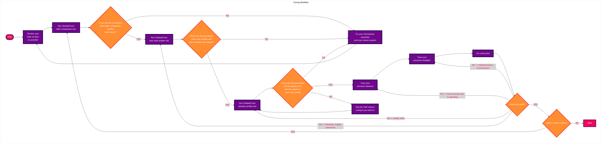

# Shake&Tune documentation

When perfecting 3D prints and tuning your printer, there is all that resonance testing stuff that Shake&Tune will try to help you with. But keep in mind that it's part of a complete process, and Shake&Tune alone won't magically make your printer print at lightning speed. Also, when using the tools, **it's important to get back to the original need: good prints**.

While there are some ideal goals described in this documentation, you need to understand that it's not always possible to achieve them due to a variety of factors unique to each printer, such as assembly precision, components quality and brand, components wear, etc. Even a different accelerometer can give different results. But that's not a problem; the primary goal is to produce clean and satisfactory prints. If your test prints look good and meet your standards, even if the response curves aren't perfect, you're on the right track. **Trust your printer and your print results more than chasing ideal graphs!** If it's satisfactory, there's no need for further adjustments.

First, you may want to read the **[input shaping and tuning generalities](./is_tuning_generalities.md)** documentation to understand how it all works and what to look for when taking these measurements.

## Shake&Tune macros

| Shake&Tune command | Resulting graphs example |
|:------|:-------:|
|[`AXES_MAP_CALIBRATION`](./macros/axes_map_calibration.md)  Verify that your accelerometer is working correctly and automatically find its Klipper's `axes_map` parameter |  |
|[`COMPARE_BELTS_RESPONSES`](./macros/compare_belts_responses.md)  Generate a differential belt resonance graph to verify relative belt tensions and belt path behaviors on a CoreXY or CoreXZ printer |  |
|[`AXES_SHAPER_CALIBRATION`](./macros/axes_shaper_calibrations.md)  Create the usual input shaper graphs to tune Klipper's input shaper filters and reduce ringing/ghosting |  |
|[`CREATE_VIBRATIONS_PROFILE`](./macros/create_vibrations_profile.md)  Measure your global machine vibrations as a function of toolhead direction and speed to find problematic ranges where the printer could be exposed to more VFAs in order to optimize your slicer speed profiles and TMC drivers parameters |  |
|[`EXCITATE_AXIS_AT_FREQ`](./macros/excitate_axis_at_freq.md)  Maintain a specific excitation frequency, useful to inspect parasite peaks and find out what is resonating |  |

## Resonance testing workflow

A standard tuning workflow might look something like this:

## Complementary ressources

  - [Sineos post](https://klipper.discourse.group/t/interpreting-the-input-shaper-graphs/9879) in the Klipper knowledge base
