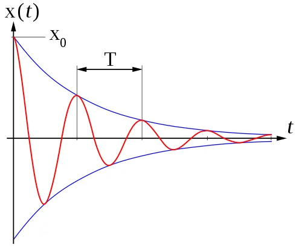

# Input shaping and tuning generalities

As more and more people are using these macros, questions about interpreting the results or properly tuning/fixing a machine mechanical behavior arise. This document aims to provide some guidance on how to interpret them. Keep in mind that there is no universal method: different people may interpret the results differently or could have other opinions. It's important to experiment and find what works best for your own 3D printer.

## Understanding ringing

When a 3D printer moves, the motors apply some force to move the toolhead along a precise path. This force is transmitted from the motor shaft to the toolhead through the entire printer motion system. When the toolhead reaches a sharp corner and needs to change direction, its inertia makes it want to continue the movement in a straight line. The motors force the toolhead to turn, but the belts act like springs, allowing the toolhead to oscillate in the perpendicular direction. These oscillations produce visible artifacts on the printed parts, known as ringing or ghosting.

## Generalities on the graphs

When tuning Input Shaper, keep the following in mind:
  1. **Focus on the shape of the graphs, not the exact numbers**. There could be differences between accelerometer boards or even printers, so there is no specific "target" value. This means that you shouldn't expect to get the same graphs between different printers, even if they are similar in term of brand, parts, size and assembly.
  1. Small differences between consecutive test runs are normal, as accelerometer quality and sensitivity is quite variable between boards.
  1. Perform the tests when the machine is heat-soaked and close to printing conditions, as the temperature will impact the machine components such as belt tension or even the frame that is known to expand a little bit.
  1. Avoid running the toolhead fans during the tests, as they introduce unnecessary noise to the graphs, making them harder to interpret. This means that even if you should heatsoak the printer, you should also refrain from activating the hotend heater during the test, as it will also trigger the hotend fan. However, as a bad fan usually introduce some vibrations, you can use the test to diagnose an unbalanced fan as seen in the [Examples of Input Shaper graphs](./macros/axis_tuning.md) section.
  1. Ensure the accuracy of your accelerometer measurements by running a `MEASURE_AXES_NOISE` test and checking that the result is below 100 for all axes. If it's not, check your accelerometer board and wiring before continuing.
  1. The graphs can only show symptoms of possible problems and in different ways. Those symptoms can sometimes suggest causes, but they rarely pinpoint the exact issues. For example, while you may be able to diagnose that some screws are not tightened properly, you will unlikely find which exact screw is problematic using only these tests. You will most always need to tinker and experiment.
  1. Finally, remember why you're running these tests: to get clean prints. Don't become too obsessive over perfect graphs, as the last bits of optimization will probably have the least impact on the printed parts in terms of ringing and ghosting.

### Note on accelerometer mounting point
Input Shaping algorithms are designed to mitigate resonances by targeting a specific resonant frequency or a range around it. When setting the filter, **the primary goal is to target the resonant frequency of the toolhead and belts system** (see the [theory behind it](#theory-behind-it)), as this has the most significant impact on print quality and is the root cause of ringing.

Choosing the accelerometer's mounting point is important. There are currently three mounting strategies, each offering distinct advantages:

| Mounting Point | Advantages | Considerations |
| --- | --- | --- |
| **Directly at the nozzle tip** | Provides a comprehensive view of all machine vibrations, including the main resonance, but also toolhead wobbling and global frame movements. Ideal for diagnosing kinematic issues and troubleshooting. | Results in noisier data, which may complicate the final Input Shaping filter selection on machines that are not perfect and/or not fully rigid. |
| **Near the toolhead's center of gravity** | Provides a view of mostly only the primary resonant frequencies of the toolhead and belts, allowing precise filter selection for Input Shaping. The data is often cleaner, with only severe mechanical issues or very problematic toolhead wobble visible on the graphs. | May provide less detail on secondary vibrations (which have a fairly minor effect on ringing) and may be less effective in diagnosing unrelated mechanical problems. |
| **Integrated accelerometer on a CANBus Board** | Simple and effective, requires no additional installation and always available. Can help for diagnosing issues like those caused by bowden tubes, umbillical coords and cable chains. If toolhead is very rigid, measurements are close enough to those of the center of gravity. | Not accurate for a detailed analysis or diagnosing mechanical issues due to distance from the nozzle tip and potential noise from attached components. |

While you should usually try to focus on the toolhead/belts mechanical subsystem for resonance mitigation (since it has the most impact on ringing and print quality), you don't want to overlook the importance of nozzle tip measurements for other sources of vibration. Indeed, if resonance analysis results vary a lot between mounting points, reinforcing the toolhead's rigidity to minimize wobbling and vibrations is recommended. Here is a strategy that attempts to methodically address mechanical issues and then allow for the day-to-day selection of input shaping filters as needed: 
  1. **Diagnosis phase**: Begin with the nozzle tip mount to identify and troubleshoot mechanical issues to ensure the printer components are healthy and the assembly is well done and optimized.
  1. **Filter selection phase**: If the graphs are mostly clean, you can transition to a mounting point near the toolhead's center of gravity for cleaner data on the main resonance, facilitating accurate Input Shaping filter settings. You can also consider the CANBus integrated accelerometer for its simplicity, especially if the toolhead is particularly rigid and minimally affected by wobble.

## Theory behind it

### Modeling the motion system
The motion system of a 3D printer can be described as a spring and mass system, best modeled as an harmonic oscillator. Have a look on [this Wikipedia article](https://en.wikipedia.org/wiki/Harmonic_oscillator) or [here](https://beltoforion.de/en/harmonic_oscillator/) for some examples. This type of system has two key parameters:

| Undamped resonnant frequency (natural frequency) | Damping ratio ζ |
| --- | --- |
| $$\frac{1}{2\pi}\sqrt{\frac{k}{m}}$$ | $$\frac{c}{2}\sqrt{\frac{1}{km}}$$ |
| `k` [N/m]: spring constant `m` [g]: moving mass | `c` [N·s/m]: viscous damping coefficient `k` [N/m]: spring constant `m` [g]: moving mass |

When an oscillating input force is applied at a resonant frequency (or a Fourier component of it) on a dynamic system, the system will oscillate at a higher amplitude than when the same force is applied at other, non-resonant frequencies. This is called a resonance and can be dangerous for some systems but on our printers this will mainly lead to vibrations and oscillations of the toolhead.

On the other hand, the damping ratio (ζ) is a dimensionless measure describing how oscillations in a system decay after a perturbation. It can vary from underdamped (ζ < 1), through critically damped (ζ = 1) to overdamped (ζ > 1).

In 3D printers, it's quite challenging to measure the spring constant `k` and even more challenging to measure the viscous damping coefficient `c`, as they are affected by various factors such as belts, plastic parts, frame rigidity, rails, friction, grease, and motor control. Furthermore, a 3D printer is made up of many subsystems, each with its own behavior. Some subsystems, such as the toolhead/belts system, have a bigger impact on ringing than others, such as the motor shaft resonance for example.

### How Input Shaping helps
The rapid movement of machines is a challenging control problem because it often results in high levels of vibration. As a result, machines are typically moved relatively slowly. Input shaping is an open-loop control method that allows for higher speeds of motion by limiting vibration induced by the reference command. It can also improve the reliability of the stealthChop mode of Trinamic stepper drivers.

It works by creating a command signal that cancels its own vibration, achieved by [convoluting](https://en.wikipedia.org/wiki/Convolution) specifically crafted impulse signals (A2) with the original system control signal (A1). The resulting shaped signal is then used to drive the system (Total Response). To craft these impulses, the system's undamped resonant frequency and damping ratio are used.

Klipper measures these parameters by exciting the printer with a series of input commands and recording the response behavior using an accelerometer. Resonances can be identified on the resulting graphs by large spikes indicating their frequency and energy. Additionnaly, the damping ratio is usually hard to measure without a special equipment, but these scripts gives an estimation that should be good enough in most cases. There is no need to use Klipper's default 0.1 value anymore!
