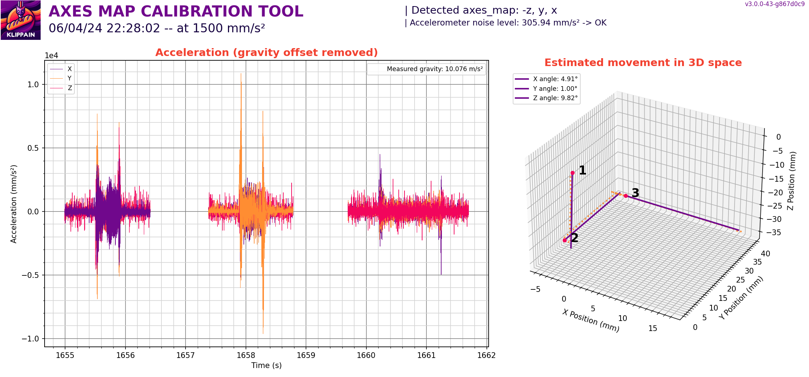
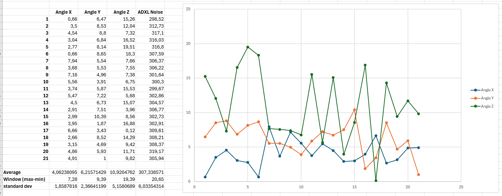

# Accelerometer "axes_map" calibration

All graphs generated by Shake&Tune show plots based on accelerometer measurements, typically labeled with the X, Y, and Z axes. If the accelerometer is rotated, its axes may not align correctly with the machine axes, making the plots more challenging to interpret, analyze, and understand. The `AXES_MAP_CALIBRATION` macro is designed to automatically measure the alignment of the accelerometer in order to set it correctly, making it easier than ever to get the most out of your data!

  > **Note**:
  >
  > This misalignment doesn't affect the accuracy of the measurements because the total sum across all axes is used in most Shake&Tune tools. It's just an optional but convenient way to configure Klipper's `[adxl345]` (or whichever accelerometer you have) "axes_map" parameter.


## Usage

Call the `AXES_MAP_CALIBRATION` macro and look for the graphs in the results folder. Here are the parameters available:

| parameters | default value | description |
|-----------:|---------------|-------------|
|Z_HEIGHT|20|z height to put the toolhead before starting the movements. Be careful, if your accelerometer is mounted under the nozzle, increase it to avoid crashing it on the bed of the machine|
|SPEED|80|speed of the toolhead in mm/s for the movements|
|ACCEL|1500 (or max printer accel)|accel in mm/s^2 used for all the moves|
|TRAVEL_SPEED|120|speed in mm/s used for all the travels moves|

  > **Note**:
  >
  > This command only works if you can move the same accelerometer in the 3 directions, like on a Voron V2.4 printer. If you have 2 accelerometers on your machine, like on a Prusa, Switchwire or Ender3, it won't work because it's impossible to detect the accelerometer orientation with only one movement (like for the bed).



During the measurement, the machine will move slightly in +X, +Y, and +Z. This allow to automatically detect the orientation of the accelerometer.

Use this value in your `printer.cfg` config file:
```
[adxl345] # replace "adxl345" by your correct accelerometer name
axes_map: -z,y,x
```

### Acceleration plot

This plot shows the acceleration data over time for the X, Y, and Z axes after removing the gravity offset. Look for patterns in the acceleration data for each axis: you should have exactly 2 spikes for each subplot (for the start and stop of the motion) that break away from the global noise. This can help identify any anomalies or inconsistencies in your accelerometer behavior.

The dynamic noise and background vibrations measured by the accelerometer are extracted from the signal (using wavelet transform decomposition) and printed in the legend. **Usually values below about 500mm/s² are ok**, but Shake&Tune will automatically add a note if too much noise is recorded. **Be careful because this value is very different from Klipper's `MEASURE_AXES_NOISE` command, as Shake&Tune measures everything during the motion**, such as accelerometer noise, but also vibrations and motor noise, axis and toolhead oscillations, etc. If you want to record your axes_map correctly, you may need to use about 10 times this value in the `ACCEL` parameter to get a good signal-to-noise ratio and allow Shake&Tune to correctly detect the toolhead acceleration and deceleration phases.

The detected gravity offset is printed in the legend to give some context to the readings and their scale: if it's too far from the standard 9.8-10 m/s², this means that your accelerometer is not working properly and should be fixed or calibrated.

### Estimated 3D movement path

This graph visualizes the estimated path of the tool head as recorded by the accelerometer in 3D space. Keep in mind that even though Shake&Tune uses some mathematical tricks to get something as accurate as possible, we don't have a gyroscope to compensate for accelerometer drift, and this plot is still pretty much an "estimate". 

When examining it, look for path consistency by checking the smoothness of the paths (orange dotted lines): they should be mostly linear. Ideally, you should expect the computed direction vectors (in purple) to appear aligned along one of the primary axes (X, Y, or Z), with minimal angular error, indicating accurate alignment of the accelerometer chip with the machine axis.

Keep in mind that since this graph is an estimate, there may be some variation between successive runs, especially in the calculated angles. For example, on my machine I had these results over 20 consecutive runs (mean square error about 3 to 5 degrees):


