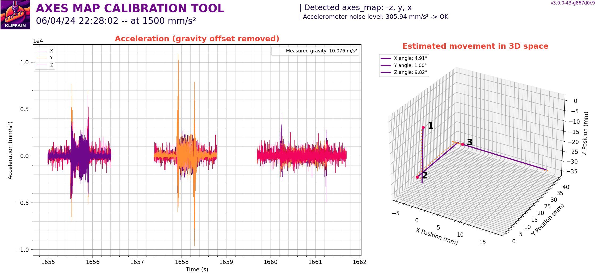

# Accelerometer "axes_map" calibration

All graphs generated by Shake&Tune show plots based on accelerometer measurements, typically labeled with the X, Y, and Z axes. If the accelerometer is rotated, its axes may not align correctly with the machine axes, making the plots more challenging to interpret, analyze, and understand. The `AXES_MAP_CALIBRATION` macro is designed to automatically measure the alignment of the accelerometer in order to set it correctly, making it easier than ever to get the most out of your data!

  > **Note**:
  >
  > This misalignment doesn't affect the accuracy of the measurements because the total sum across all axes is used in most Shake&Tune tools. It's just an optional but convenient way to configure Klipper's `[adxl345]` (or whichever accelerometer you have) "axes_map" parameter.


## Usage

Call the `AXES_MAP_CALIBRATION` macro and look for the graphs in the results folder. Here are the parameters available:

| parameters | default value | description |
|----------:|---------------|-------------|
|Z_HEIGHT|20|z height to put the toolhead before starting the movements. Be careful, if your accelerometer is mounted under the nozzle, increase it to avoid crashing it on the bed of the machine|
|SPEED|80|speed of the toolhead in mm/s for the movements|
|ACCEL|1500 (or max printer accel)|accel in mm/s^2 used for all the moves|
|TRAVEL_SPEED|120|speed in mm/s used for all the travels moves|

  > **Note**:
  >
  > This tool also works on 2-axis machines (Voron Trident, Ender3, Switchwire, etc.) where the accelerometer only moves on 2 axes. See the [2-axis machines](#support-for-2-axis-machines) section for details.



During the measurement, the machine will move slightly in +X, +Y, and +Z. This allows automatic detection of the accelerometer orientation.

Use this value in your `printer.cfg` config file:
```
[adxl345] # replace "adxl345" by your correct accelerometer name
axes_map: -z,y,x
```

## How it works

The algorithm uses a **velocity-based detection** approach that is robust to mechanical vibrations and structural ringing:

### The challenge with 3D printers

When the toolhead accelerates, the mechanical system (belts, carriages, frame) acts as a damped harmonic oscillator. This means:
- Instead of a clean acceleration pulse, you get damped oscillations (ringing)
- These oscillations appear on ALL accelerometer axes due to mechanical coupling
- The ringing frequency is typically 50-200 Hz (your printer's resonance frequencies)

### The solution: Low-pass filtering + velocity integration

1. **Low-pass filtering**: A 25 Hz cutoff filter removes the structural ringing (50+ Hz) while preserving the motion signal (< 30 Hz for typical movements).

2. **Velocity integration**: Instead of analyzing acceleration peaks directly, we integrate the filtered acceleration to get velocity. This is robust because:
   - Integration naturally smooths out oscillations
   - The peak velocity during a move is unambiguous
   - Only single integration is needed (minimal drift)

3. **Peak velocity detection**: For each movement (X, Y, Z), we find which accelerometer axis has the largest peak velocity. That axis is aligned with the motion direction.

4. **Sign detection**: The sign of the peak velocity directly indicates the orientation:
   - Positive peak velocity = accelerometer axis aligned with +Machine direction
   - Negative peak velocity = accelerometer axis inverted (-Machine direction)

5. **Angle calculation**: The algorithm computes both per-axis tilt angles and full Euler angles (roll, pitch, yaw) to describe the accelerometer orientation.

6. **Euler angle extraction**: The algorithm computes the full accelerometer orientation as Euler angles (XYZ intrinsic convention):
   - **Roll**: Rotation about the machine X axis
   - **Pitch**: Rotation about the machine Y axis
   - **Yaw**: Rotation about the machine Z axis

   These angles tell you exactly HOW the accelerometer is tilted relative to the machine frame. For example, "roll=2°, pitch=-1.5°, yaw=0°" means the accelerometer is tilted 2 degrees around X and -1.5 degrees around Y.


## Support for 2-axis machines

Some printer kinematics move the bed instead of the toolhead on certain axes. This means the toolhead-mounted accelerometer doesn't physically move on that axis and only records noise:

| Printer Type | Toolhead axes | Bed axis | Accelerometer detects |
|--------------|---------------|----------|----------------------|
| Voron 2.4    | X, Y, Z       | -        | X, Y, Z (all)        |
| Voron Trident| X, Y          | Z        | X, Y only            |
| Ender3/Switchwire | X, Z    | Y        | X, Z only            |

### Automatic detection

Shake&Tune automatically detects when exactly one axis has noise-only data by checking:
- **Low confidence**: Below 30% (no dominant axis in velocity signal)
- **Low velocity**: Below 1/4 of the maximum velocity measured on other axes

When detected, the tool:
1. Identifies the noise-only axis as a "bed axis"
2. Extrapolates the missing direction using the cross product of the two measured axes
3. Marks it as "(extrap.)" in all outputs

The resulting axes_map is mathematically correct and will work perfectly for your printer!

### Visual indicators

When an axis is extrapolated:
- **Console output**: Shows "(EXTRAPOLATED - accelerometer stationary on this axis)"
- **Graph header**: Shows "(extrap.)" instead of angle error
- **Velocity plot**: Gray shaded zone with "Extrapolated (bed axis)" label
- **3D plot**: Semi-transparent arrow with "(extrap.)" suffix

### Important notes for 2-axis machines

- The extrapolated axis direction is computed mathematically from the two measured axes
- Euler angles (roll, pitch, yaw) are still computed but the extrapolated axis contributes 0° error
- The tool will raise an error if more than one axis has no signal (accelerometer mounting issue)


## Understanding the graph

The graph displays a 1×2 layout with two panels:

### Left Panel: Velocity Sequence Plot

Shows the full measurement sequence with all velocity curves:

- **Large watermark letters**: "X", "Y", "Z" in the background indicate which machine axis movement is happening in each time region
- **Confidence percentages**: Shown below each watermark letter
- **Velocity curves**: All three accelerometer velocity traces (purple/orange/red) plotted continuously
- **Peak markers**: Highlighted points showing the peak velocity detected in each zone
- **Zone separators**: Vertical dashed lines between the X, Y, and Z movements
- **Secondary legend**: Displays measured gravity and noise level

This plot shows the raw detection process - you can see how the algorithm identifies which accelerometer axis has the largest velocity peak during each machine movement.

### Right Panel: 3D Orientation

The 3D visualization shows the **actual measured** accelerometer orientation:

- **Gray dashed arrows**: The machine reference axes (X, Y, Z) pointing in the standard directions
- **Colored solid arrows**: The accelerometer axes as **actually measured** by the calibration:
  - **Purple arrow (x)**: Where accelerometer X-axis actually points in machine space
  - **Orange arrow (y)**: Where accelerometer Y-axis actually points in machine space
  - **Red/Pink arrow (z)**: Where accelerometer Z-axis actually points in machine space

Unlike a perfectly aligned accelerometer where colored arrows would overlap with gray machine axes, this view shows the actual tilt. A slight misalignment (a few degrees) is normal and won't affect measurements significantly.

### Header Information

The header displays:
- **Detected axes_map**: The configuration value for your `printer.cfg`
- **Axis mappings**: For each machine axis, shows which accelerometer axis detected the motion and the tilt angle
- **Euler angles (Tilt)**: Roll, pitch, and yaw values quantifying the accelerometer's rotation:
  - **Roll** = rotation about machine X
  - **Pitch** = rotation about machine Y
  - **Yaw** = rotation about machine Z


## Quality indicators

The tool provides several quality metrics:

- **Noise level**: Measured in mm/s² (before filtering). Values below 350 are good, 350-700 generate a warning, above 700 is an error.
- **Confidence**: How much larger the primary axis peak velocity is compared to secondary axes. Should be above 50%.
- **Tilt angle**: How far the accelerometer axis deviates from the machine axis. Values above 15° generate a warning.
- **Gravity**: Should be close to 9.81 m/s². Unusual values indicate accelerometer calibration issues.


## Troubleshooting

### "Same accelerometer axis detected for multiple machine axes"
This error means the algorithm couldn't uniquely map each machine axis to a different accelerometer axis. Possible causes:
- Accelerometer mounted at ~45 degrees between axes
- Very noisy data making detection unreliable
- Accelerometer malfunction

**Solution**: Remount the accelerometer so it's better aligned with the machine axes, or increase the ACCEL parameter for stronger signals.

### Low confidence warning
The detection confidence is low, meaning the primary axis peak velocity wasn't much larger than secondary axes.

**Solution**: Increase the ACCEL parameter to get stronger velocity signals.

### High noise level
Too much vibration or accelerometer noise is present in the data.

**Solution**: Check accelerometer wiring, mounting, and ensure the machine is on a stable surface during calibration.

### High tilt angle warning
The accelerometer is mounted with significant rotation from the machine axes.

**Solution**: If accuracy matters for your use case, consider remounting the accelerometer more carefully aligned with the machine axes. Otherwise, the detected axes_map will still work correctly.

### Unusual gravity reading
The measured gravity is not close to 9.81 m/s².

**Solution**: This may indicate an accelerometer calibration issue or a faulty sensor. Check the accelerometer connection and consider replacing it if the issue persists.
