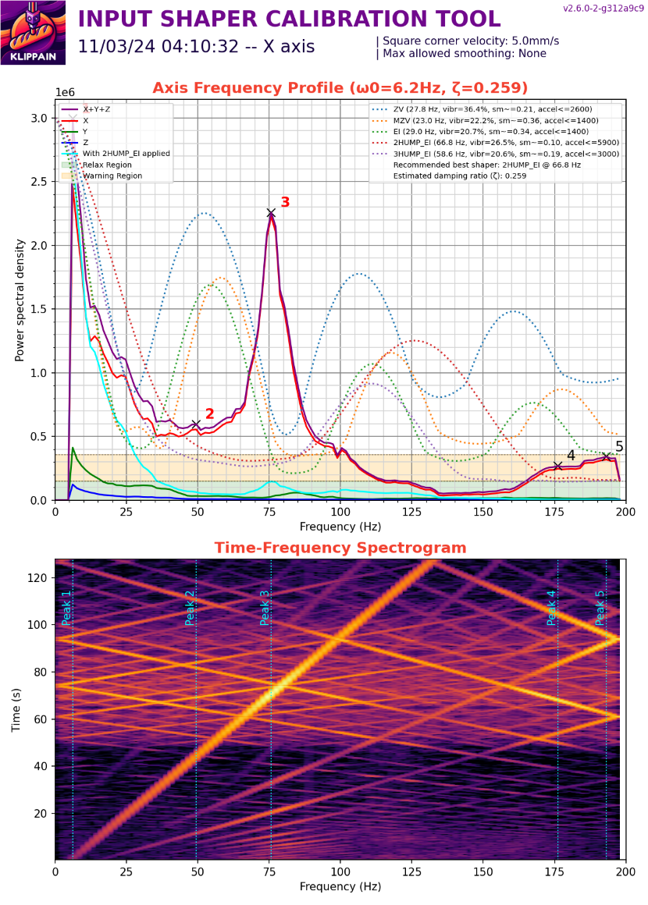

# Input shaper filters calibration

The `AXES_SHAPER_CALIBRATION` macro is used to measure and plot your machine axis frequency profiles in order to tune Klipper's input shaper system.


## Usage

**Before starting, ensure that the belts are properly tensioned** and that you already have good and clear belt graphs (see [the previous section](./belts_tuning.md)).

Then, call the `AXES_SHAPER_CALIBRATION` macro and look for the graphs in the results folder. Here are the parameters available:

| parameters | default value | description |
|-----------:|---------------|-------------|
|FREQ_START|None (default to `[resonance_tester]` value)|starting excitation frequency|
|FREQ_END|None (default to `[resonance_tester]` value)|maximum excitation frequency|
|HZ_PER_SEC|1|number of Hz per seconds for the test|
|ACCEL_PER_HZ|None (default to `[resonance_tester]` value)|accel per Hz value used for the test|
|AXIS|"all"|axis you want to test in the list of "all", "X" or "Y"|
|SCV|printer square corner velocity|square corner velocity you want to use to calculate shaper recommendations. Using higher SCV values usually results in more smoothing and lower maximum accelerations|
|MAX_SMOOTHING|None|max smoothing allowed when calculating shaper recommendations|
|TRAVEL_SPEED|120|speed in mm/s used for all the travel movements (to go to the start position prior to the test)|
|Z_HEIGHT|None|Z height wanted for the test. This value can be used if needed to override the Z value of the probe_point set in your `[resonance_tester]` config section|
|MAX_SCALE|None|Maximum energy value to scale the input shaper graph. Useful for comparing multiple consecutive tests by forcing the same energy scale|


  > **Note**
  >
  > If you are wondering wether you should use sweeping or not, have a read on the [dedicated section here](../is_tuning_generalities.md#should-i-use-the-sweeping-or-pulse-only-test).


## Generalities on IS graphs

To effectively analyze input shaper graphs, there is no one-size-fits-all approach due to the variety of factors that can impact the 3D printer's performance or input shaper measurements. However, here are some hints on reading the graphs:
  - A graph with a **single and thin peak** well detached from the background noise is ideal, as it can be easily filtered by input shaping. But depending on the machine and its mechanical configuration, it's not always possible to obtain this shape. The key to getting better graphs is a clean mechanical assembly with a special focus on the rigidity and stiffness of everything, from the table the printer sits on to the frame and the toolhead.
  - As for the belt graphs, **focus on the shape of the graphs, not the values**. Indeed, the energy value doesn't provide much useful information. Use it only to compare two of your own graphs and to measure the impact of your mechanical changes between two consecutive tests, but never use it to compare against graphs from other people or other machines.


For setting your Input Shaping filters, rely on the auto-computed values displayed in the top right corner of the graph. Here's a breakdown of the legend for a better grasp:
  - **Filtering algortihms**: This computation works pretty well if the graphs are clean enough. But if your graphs are junk, it can't do magic and will give you pretty bad recommendations. It's better to address the mechanical issues first before continuing. Each shapers has its pro and cons:
    * `ZV` is a pretty light filter and usually has some remaining vibrations. Use it only if you want to do speed benchies and get the highest accelerations while maintaining a low amount of smoothing on your parts. If you have "perfect" graphs and do not care that much about some remaining ringing, you can try it.
    * `MZV` is usually the top pick for well-adjusted machines. It's a good compromise for low remaining vibrations while still allowing pretty good accelerations. Keep in mind, `MZV` is only recommended on good graphs.
    * `EI` can be used as a fallback for challenging graphs. But first, try to fix your mechanical issues before using it: almost every printer should be able to run `MZV` instead.
    * `2HUMP_EI` and `3HUMP_EI` are last-resort choices as they usually lead to a high level of smoothing. If they pop up as the main suggestions, it's likely your machine has underlying mechanical issues (that lead to pretty bad or "wide" graphs).
  - **Recommended Acceleration** (`accel<=...`): This isn't a standalone value: you need to also consider the `vibr` and `sm` values as it's a compromise between the three. They will give you the remaining vibrations and the smoothing after Input Shaping, at the recommended acceleration. Nothing will prevent you from using higher acceleration values; they are not a limit. However, in this case, Input Shaping may not be able to suppress all the ringing on your parts, and more smoothing will occur. Finally, keep in mind that high accelerations are not useful at all if there is still a high level of remaining vibrations: you should address any mechanical issues first.
  - **The remaining vibrations** (`vibr`): This directly correlates to ringing. Ideally, you want a filter with minimal remaining vibrations.
  - **Shaper recommendations**: This script will give you some tailored recommendations based on your graphs. Pick the one that suit your needs:
    * The "performance" shaper, which should be good for most people as it's a compromise for high accelerations, with little residual vibrations that should remove most ringing on your parts.
    * The "low vibration" shaper aims for a lower level of remaining vibration to ensure the best print quality with minimal ringing. This should be used in case the performance shaper is not good enough for your needs.
    * Sometimes only a single recommendation is given as the "best" shaper. This means that either no suitable "performance" shaper was found (due to a high level of residual vibrations or too much smoothing), or that the "low vibration" shaper is the same as the "performance" shaper.
  - **Damping Ratio**: At the end, you will see an estimate based on your measured data, which will be used to better tailor the shaper recommendations to your machine. You need to define it in the `[input_shaper]` section.

Then, add to your configuration:
```
[input_shaper]
shaper_freq_x: ... # center frequency for the X axis filter
shaper_type_x: ... # filter type for the X axis
shaper_freq_y: ... # center frequency for the Y axis filter
shaper_type_y: ... # filter type for the Y axis
damping_ratio_x: ... # damping ratio for the X axis
damping_ratio_y: ... # damping ratio for the Y axis
```

## Useful facts and myths debunking

Some people suggest to cap data at 100 Hz by manually editing the .csv file, thinking values beyond that are wrong. But this can be misleading. The excitation and system's response frequencies differ, and aren't directly linked. You might see vibrations beyond the excitation range, and removing them from the file just hides potential issues. Though these high-frequency vibrations might not always affect print quality, they could signal mechanical problems. Instead of hiding them, look into resolving these issues.

Regarding printer components, I do not recommend using an extra-light X-beam (aluminum or carbon). They might seem ideal due to their weight, but there's more to consider than just mass such as the rigidity (see the [theory behind it](../is_tuning_generalities.md#theory-behind-it)). These light beams can be more flexible and will impact negatively the Y axis graphs as they will flex under high accelerations.

Finally, keep in mind that each axis has its own properties, such as mass and geometry, which will lead to different behaviors for each of them and will require different filters. Using the same input shaping settings for both axes is only valid if both axes are similar mechanically: this may be true for some machines, mainly Cross gantry configurations such as [CroXY](https://github.com/CroXY3D/CroXY) or [Annex-Engineering](https://github.com/Annex-Engineering) printers, but not for others.


## Examples of graphs

In this section, I'll walk you through some random graphs sourced online or shared with me for analysis. My aim is to highlight the good and the not-so-good, offering insights to help you refine your printer's Input Shaping settings.

That said, interpreting Input Shaper graphs isn't an exact science. While we can make educated guesses and highlight potential issues from these graphs, pinpointing exact causes isn't always feasible. So, consider the upcoming graphs and their comments as pointers on your input shaping journey, rather than hard truths.

### Good graphs

These two graphs are considered good and is what you're aiming for. They each display a single, distinct peak that stands out clearly against the background noise. Note that the main frequencies of the X and Y graph peaks differ. This variance is expected and normal, as explained in the last point of the [useful facts and myths debunking](#useful-facts-and-myths-debunking) section. The spectrogram is clean with only the resonance diagonals. Note that a fan was running during the test, as shown by the purple vertical line (see section [fan behavior](#fan-behavior)).

| Good X graph | Good Y graph |
| --- | --- |
|  |  |

### Low frequency energy

These graphs have low frequency (near 0 Hz) at a rather low maximum amplitude (around 1e2 or 1e3) signal. This means that there is some binding, rubbing, or grinding during motion: basically, something isn't moving freely. Minor low frequency energy in the graphs can be due to many problems, such as a faulty idlers/bearing or an over-tightened carriage screw that prevents it from moving freely on its linear rail, a belt running on a bearing flange, ... However, large amounts of low frequency energy indicate more important problems such as improper belt routing (the most common), or defective motor, ...

Here's how to troubleshoot the issue:
  1. **Belts Examination**:
     - Ensure your belts are properly routed.
     - Check for correct alignment of the belts on all bearing flanges during movement (check them during a print).
     - Belt dust is often a sign of misalignment or wear.
  1. **Toolhead behavior on CoreXY printers**: With motors off and the toolhead centered, gently push the Y-axis front-to-back. The toolhead shouldn't move left or right. If it does, one of the belts might be obstructed and requires inspection to find out the problem.
  1. **Gantry Squareness**:
     - Ensure your gantry is perfectly parallel and square. You can refer to [Nero3D's de-racking video](https://youtu.be/cOn6u9kXvy0?si=ZCSdWU6br3Y9rGsy) for guidance.
     - After removing the belts, test the toolhead's movement by hand across all positions. Movement should be smooth with no hard points or areas of resistance.

| Small binding | Heavy binding |
| --- | --- |
|  |  |

### Double peaks or wide peaks

Such graph patterns can arise from various factors, and there isn't a one-size-fits-all solution. To address them:
  1. A wobbly table can be the cause. So first thing to do is to try with the printer directly on the floor.
  1. Ensure optimal belt tension using the [`COMPARE_BELTS_RESPONSES` macro](./belts_tuning.md).
  1. If problems persist, it might be due to an improperly squared gantry. For correction, refer to [Nero3D's de-racking video](https://youtu.be/cOn6u9kXvy0?si=ZCSdWU6br3Y9rGsy).
  1. If it's still there... you will need to find out what is resonating to fix it. You can use the `EXCITATE_AXIS_AT_FREQ` macro to help you find it.

| Two peaks | Single wide peak |
| --- | --- |
|  |  |

### Problematic CANBUS speed

Using CANBUS toolheads with an integrated accelerometer chip can sometimes pose challenges if the CANBUS speed is set too low. While users might lower the bus speed to fix Klipper's timing errors, this change will also affect input shaping measurements. An example outcome of a low bus speed is the following graph that, though generally well-shaped, appears jagged and spiky throughout. Additional low-frequency energy might also be present. For optimal accelerometer board operation on your CANBUS toolhead, a speed setting of 500k is the minimum, but 1M is advisable. You might want to look at [this excellent guide by Esoterical](https://github.com/Esoterical/voron_canbus/tree/main).

| CANBUS problem present | CANBUS problem solved |
| --- | --- |
|  |  |

### Toolhead or TAP wobble

The [Voron TAP](https://github.com/VoronDesign/Voron-Tap) can introduce anomalies to input shaper graphs, notably on the X graph. Its design with an internal MGN rail introduces a separate and decoupled mass, leading to its own resonance, typically around 125Hz.

Small 125Hz peaks are also most often due to the toolhead itself, since most toolheads are about the same mass. Common culprits include loose screws or a bad quality X linear MGN axis that can have some play in the carriage, causing the toolhead to wobble slightly. This is often shown as a Z component in the graphs and can be amplified by the bowden tube or an umbilical that applies some forces on top of the toolhead.

If your graph shows this kind of anomalies:
  1. Start by looking at the bowden tube and umbilical to make sure they are not exerting excessive force on the toolhead. You want them to create no drag or as little drag as possible.
  1. If that's not enough, continue disassembling the toolhead down to the X carriage. Check for any loose or cracked parts, then reassemble, making sure everything is tightened properly for a rigid assembly.
  1. When using TAP, this can be quite a challenge to combat, but using quality components and careful assembly can help mitigate the problem. In particular, be sure to use a well-preloaded TAP MGN rail for maximum rigidity, coupled with genuine and strong N52 magnets that are properly seated and not loose.
  1. Don't forget to check your extruder and make sure you have some filament loaded during the measurements to avoid extruder gear vibration.

| TAP wobble problem | TAP wobble problem mitigated<br/>Or toolhead wobbling |
| --- | --- |
|  |  |

### Fan behavior

The presence of an unbalanced or poorly running fan can be directly observed in the spectrogram:
  1. A properly running fan can be seen as a vertical purple line on the spectrogram that doesn't shine too much. This is perfectly normal because it's running at a constant speed (i.e. constant frequency) throughout the test. The purple color means that its vibration energy is quite low and should not cause any problems. There are no corresponding peaks on the top graph.
  1. When the vertical line on the spectrogram starts to become yellowish, pay special attention to the top graph to see if there is a corresponding peak. In the example from the middle below, the fan is in the limit with a very small bump corresponding to it. So it may or may not cause trouble... Do some test prints and look for VFAs, if you find some you may want to replace the fan.
  1. If the vertical line is bright orange/yellow, there will most likely be a corresponding thin but high peak on the top graph. This fan is out of balance, producing bad vibrations and needs to be replaced.

| Healthy fan running | Fan start to be problematic | Fan need to be changed |
| --- | --- | --- |
|  |  |  |

### Spectrogram lightshow (LIS2DW)

The integration of LIS2DW as a resonance measuring device in Klipper is becoming more and more common, especially because some manufacturers are promoting its superiority over the established ADXL345. It's indeed a new generation chip that should be better to measure traditional "accelerations". However, a detailed comparison of their datasheets and practical measurements paints a more complex picture: the LIS2DW boasts greater sensitivity, but it has a lower sampling rate and produce significant aliasing that results in a "lightshow" effect on the spectrogram, characterized by multiple spurious resonance lines parallel to the main resonance, accompanied by intersecting interference lines that distort the harmonic profile.

While in most cases the overall shape of the upper resonance curve, including resonant frequency and damping ratio, should be close to reality with fairly similar input shaping filter recommendations, this aliasing makes it difficult to identify subtle details and complicates the diagnosis of mechanical problems. In particular, it introduces a potential misinterpretation of "[binding](#low-frequency-energy)" due to a global offset of the curve. In the worst cases (see the last example below), the aliasing is too severe and adds too much noise to the graph, making it unusable.

  > **Note**:
  >
  > It seems that some LIS2DW chips are better than others: in some cases aliasing is not a problem, but it can also be very problematic and lead to bad graphs, as seen in the "Extreme Aliasing" example below.

| ADXL345 measurement | LIS2DW measurement | LIS2DW extreme aliasing |
| --- | --- | --- |
|  |  |  |

### Crazy graphs and miscs

The depicted graphs are challenging to analyze due to the overwhelming noise across the spectrum. Such patterns are often associated with an improperly assembled and non-squared mechanical structure. To address this:
  1. Refer to the [Low frequency energy](#low-frequency-energy) section for troubleshooting steps.
  1. If unresolved, consider disassembling the entire gantry, inspect the printed and mechanical components, and ensure meticulous reassembly. A thorough and careful assembly should help alleviate the issue. Measure again post-assembly for changes.

Also please note that for this kind of graphs, as they are mainly consisting of noise, Klipper's algorithm recommendations must not be used and will not help with ringing. You will need to fix your mechanical issues instead!

| Crazy X | Crazy Y |
| --- | --- |
|  |  |
