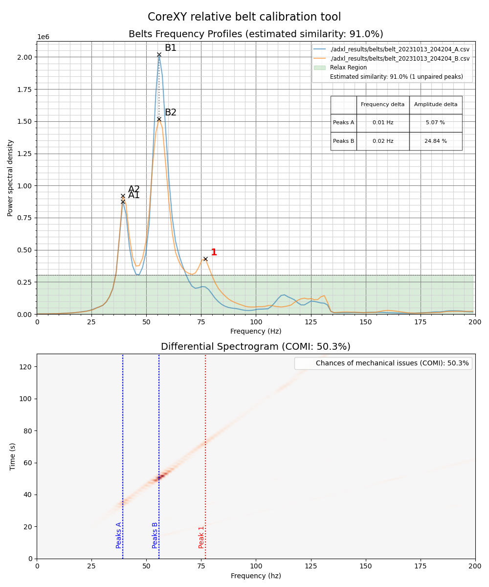
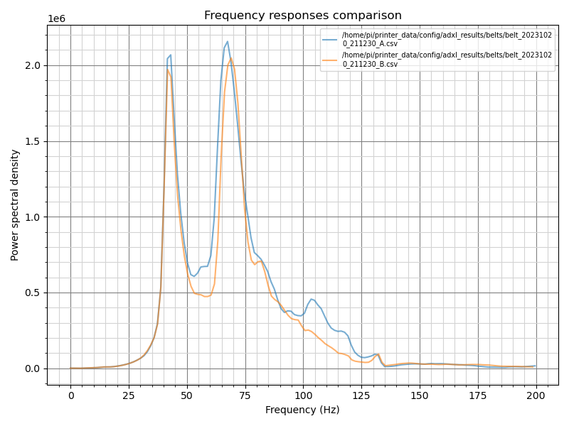
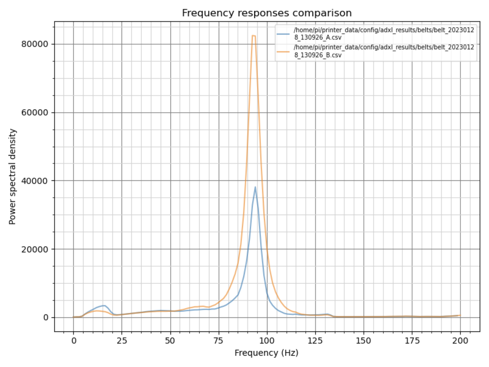
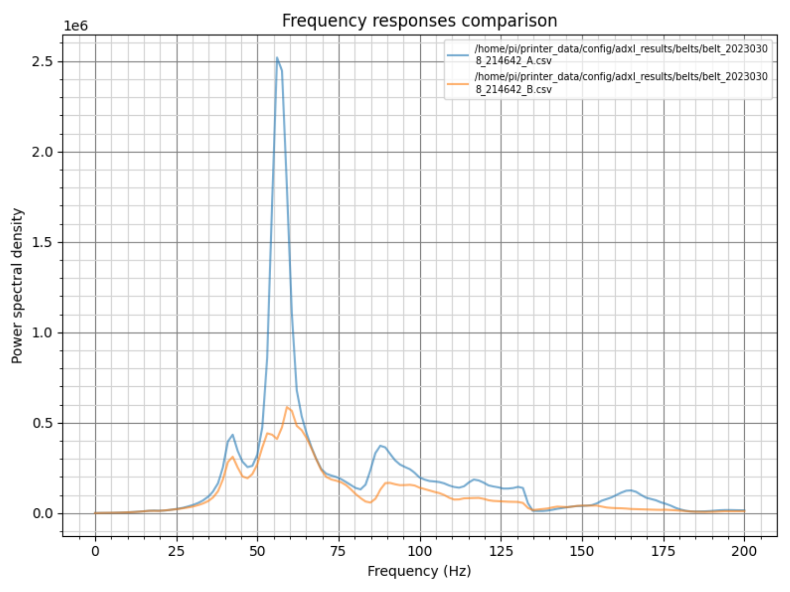
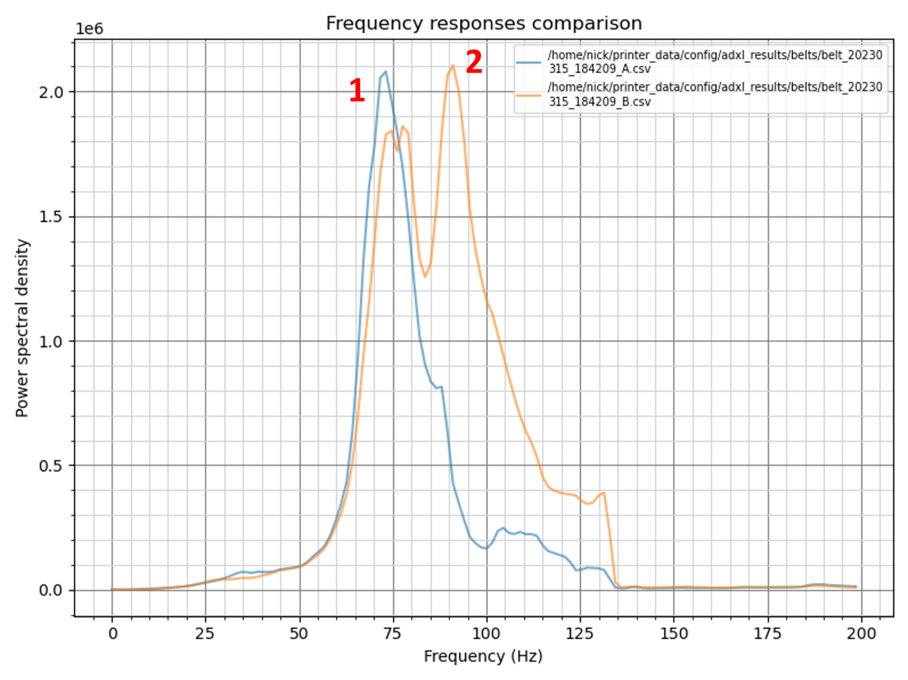
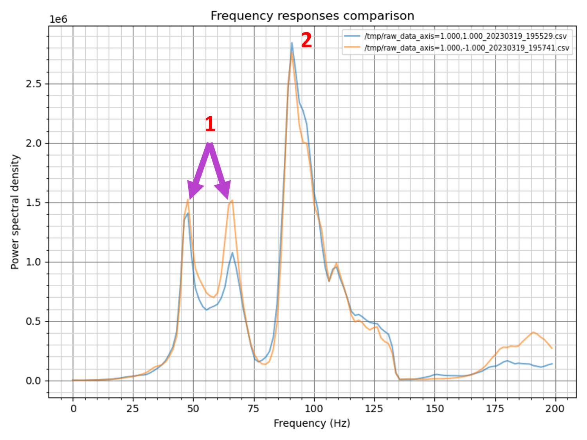
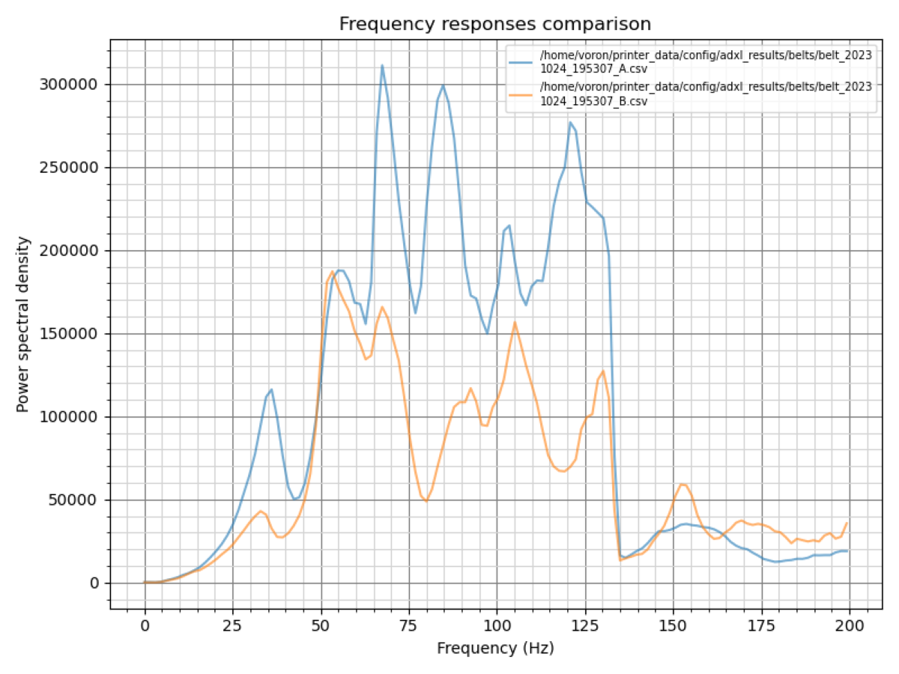
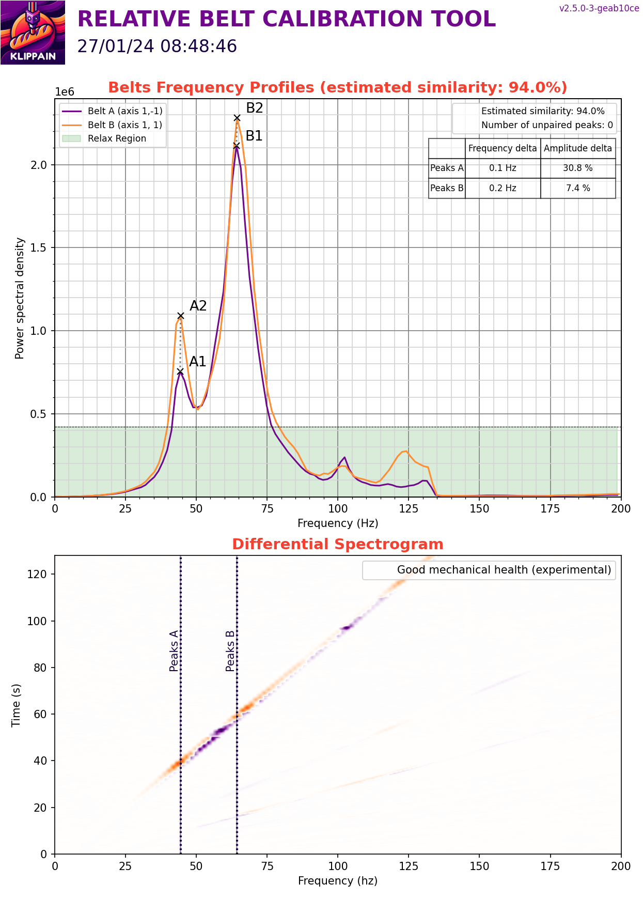
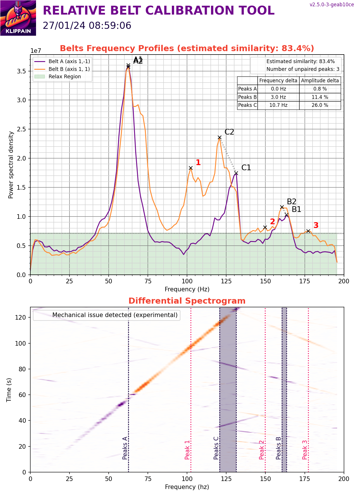

# Measuring belts relative differences

The `COMPARE_BELTS_RESPONSES` macro is dedicated for CoreXY or CoreXZ machines where it can help you to diagnose belt path problems by measuring and plotting the differences between their behaviors. It will also help you tension your belts at the same tension.

  > **Note**:
  >
  > While it might be tempting to use it on other kinds of printers, such as Cartesian printers, it's probably not the best idea. After all, it's normal to have different responses in that case due to the belts paths being not symmetric.

## Usage

**Before starting, ensure that the belts are properly tensioned**. For example, you can follow the [Voron belt tensioning documentation](https://docs.vorondesign.com/tuning/secondary_printer_tuning.html#belt-tension). You've got to have a solid foundation to build on!

Then, call the `COMPARE_BELTS_RESPONSES` macro and look for the graphs in the results folder. Here are the parameters available:

| parameters | default value | description |
|-----------:|---------------|-------------|
|FREQ_START|None (default to `[resonance_tester]` value)|starting excitation frequency|
|FREQ_END|None (default to `[resonance_tester]` value)|maximum excitation frequency|
|HZ_PER_SEC|1|number of Hz per seconds for the test|
|ACCEL_PER_HZ|None (default to `[resonance_tester]` value)|accel per Hz value used for the test|
|TRAVEL_SPEED|120|speed in mm/s used for all the travel movements (to go to the start position prior to the test)|
|Z_HEIGHT|None|Z height wanted for the test. This value can be used if needed to override the Z value of the probe_point set in your `[resonance_tester]` config section|

### Belts frequency profiles

On these graphs, **you want both curves to look similar and overlap to form a single curve**: try to make them fit as closely as possible in frequency **and** in amplitude. Usually a belt graph is composed of one or two main paired peaks (more than 2 peaks can hint about mechanical problems). It's acceptable to have "noise" around the main peaks, but it should be present on both curves with a comparable amplitude. Keep in mind that when you tighten a belt, its peaks should move diagonally toward the upper right corner, changing significantly in amplitude and slightly in frequency. Additionally, the magnitude order of the main peaks *should typically* range from ~500k to ~2M on most machines.

Aside from the actual belt tension, the resonant frequency/amplitude of the curves depends primarily on three parameters:
  - the *mass of the toolhead*, which is identical on CoreXY, CrossXY and H-Bot machines for both belts. So this will unlikely have any effect here
  - the *belt "elasticity"*, which changes over time as the belt wears. Ensure that you use the **same belt brand and type** for both A and B belts and that they were **installed at the same time**: you want similar belts with a similar level of wear!
  - the *belt path length*, which is why they must have the **exact same number of teeth** so that one belt path is not longer than the other when tightened at the same tension. This specific point is very important: a single tooth difference is enough to prevent you from having a good superposition of the curves. Moreover, it is even one of the main causes of problems found in Discord resonance testing channels.

**If these three parameters are met, there is no way that the curves could be different** or you can be sure that there is an underlying problem in at least one of the belt paths. Also, if the belt graphs have low amplitude curves and/or a lot of noise, you will probably also have poor input shaper graphs. So before you continue, ensure that you have good belt graphs by fixing your mechanical issues first.

### Cross-belts comparison plot

The Cross-Belts plot is an innovative cool way to compare the frequency profiles of the belts at every frequency point. In this plot, each point marks the amplitude response of each belt at different frequencies, connected point by point to trace the frequency spectrum. Ideally, these points should align on the diagonal center line, indicating that both belts have matching energy response values at each frequency. 

The good zone, wider at the bottom (low-amplitude regions where the deviation doesn't matter much) and narrower at the top right (high-energy region where the main peaks lie), represents acceptable deviations. So **you want all points to be close to the ideal center line and as many as possible within the green zone**, as this means that the belts are well tuned and behave similarly.

Paired peaks at the same frequency will be on the same point (labeled α1/α2, β1/β2, ...) and the distance from the center line will show the difference in energy. For paired peaks that also have a frequency delta between them, they are displayed as two points (labeled α1 and α2, ...) and the additional distance between them along the plotted line represents their frequency delta.

### Estimated similarity and mechanical issues indicator

  1. **The estimated similarity** measure provides a quantitative view of how closely the frequency profiles of the two belts match across their entire range. A similarity value close to 100% means that the belts are well matched, indicating equal tension and uniform mechanical behavior.
  2. **The mechanical health indicator** provides another assessment of the printer's operating condition based on the estimated similarity and influenced by the number of paired and unpaired peaks. A noisy signal generally lowers the value of this indicator, indicating potential problems. However, this measure can sometimes be misleading, so it's important not to rely on it alone and to consider it in conjunction with the other information displayed.

  > **Note**:
  >
  > If you're using this tool to check or adjust the tension after installing new belts, you'll want to measure again after a few hours of printing. This is because the tension can change slightly as the belts stretch and settle to their final tension. But don't worry, a few hours of printing should be more than enough!

## Advanced explanation on why 1 or 2 peaks

The belt graph is created by doing diagonal movements designed to stimulate the system using only one motor at a time. The goal is to assess the behavior of each belt in order to compare them but it's not that straightforward due to a couple of factors:
  1. Diagonal movements can be split into two distinct sub-systems: the toolhead moving left-to-right along the X linear axis and the movement of the couple toolhead and X linear axis moving in a front-to-back direction. Essentially, instead of a singular harmonic system, we're observing two intertwined sub-systems in motion. This complexity might lead to two resonance frequencies (or peaks) in the belt graph. But since both subsystems utilize similar belts, tension, etc... these peaks can sometimes merge, appearing as one.
  2. The toolhead is continuously linked to the two belts. When doing a diagonal movement to stimulate only one belt, the other belt stay static and serves as an anchor. But given its elasticity, this belt doesn't remain rigid. It imparts its unique traits to the overall system response, which may introduce additional noise or even a second peak.

## Examples of graphs

### Good graphs

The following graphs are considered good. Both of them have only one or two peaks, and they overlap pretty well to form a single curve. If you get something like this, you can continue with the [Axis Input Shaper Graphs](./axis_tuning.md).

| With only a single peak | With two peaks |
| --- | --- |
|  |  |

### Incorrect belt tension

The following graphs show the effect of incorrect or uneven belt tension. Remember that if you have to make large adjustments, always **check your belt tension between each step and make only small adjustments** to avoid breaking your machine by overtightening the belts!

| Comment | Example |
| --- | --- |
| The A belt tension is slightly lower than the B belt tension. This can be quickly remedied by tightening the screw only about one-half to one full turn. &nbsp; &nbsp; &nbsp; &nbsp; &nbsp; &nbsp; &nbsp; &nbsp; &nbsp; &nbsp; &nbsp; &nbsp; &nbsp; &nbsp; &nbsp; &nbsp; &nbsp; &nbsp; |  |
| B belt tension is significantly lower than the A belt. If you encounter this graph, I recommend going back to the [Voron belt tensioning documentation](https://docs.vorondesign.com/tuning/secondary_printer_tuning.html#belt-tension) for a more solid base. However, you could slightly increase the B tension and decrease the A tension, but exercise caution to avoid diverging from the recommended 110Hz base. |  |

### Belt path problem

If there's an issue within the belt path, aligning and overlaying the curve might be unachievable even with proper belt tension. Begin by verifying that each belt has **the exact same number of teeth**. Then, inspect the belt paths, bearings, any signs of wear (like belt dust), and ensure the belt aligns correctly on all bearing flanges during motion.

| Comment | Example |
| --- | --- |
| On this chart, there are two peaks. The first pair of peaks seems nearly aligned, but the second peak appears solely on the B belt, significantly deviating from the A belt. This suggests an issue with the belt path, likely with the B belt. |  |
| This chart is quite complex, displaying 3 peaks. While all the pairs seem well-aligned and tension ok, there are more than just two total peaks because `[1]` is split in two smaller peaks. This could be an issue, but it's not certain. It's recommended to generate the [Axis Input Shaper Graphs](./axis_tuning.md) to determine its impact. |  |
| This graph might indicate too low belt tension, but also potential binding, friction or something impeding the toolhead's smooth movement. Indeed, the signal strength is considerably low (with a peak around 300k, compared to the typical ~1M) and is primarily filled with noise. Start by going back [here](https://docs.vorondesign.com/tuning/secondary_printer_tuning.html#belt-tension) to establish a robust tension foundation. Next, produce the [Axis Input Shaper Graphs](./axis_tuning.md) to identify any binding and address the issue. |  |

### Spectrogram lightshow (LIS2DW)

The integration of LIS2DW as a resonance measuring device in Klipper is becoming more and more common, especially because some manufacturers are promoting its superiority over the established ADXL345. It's indeed a new generation chip that should be better to measure traditional "accelerations". However, a detailed comparison of their datasheets and practical measurements paints a more complex picture: the LIS2DW boasts greater sensitivity, but it has a lower sampling rate and produce significant aliasing that results in a "lightshow" effect on the spectrogram, characterized by multiple spurious resonance lines parallel to the main resonance, accompanied by intersecting interference lines that distort the harmonic profile.

For the belt graph, this can be problematic because it can introduce a lot of noise into the results and make them difficult to interpret, and it will probably tell you that there is a mechanical problem when there isn't.

| ADXL345 measurement | LIS2DW measurement |
| --- | --- |
|  |  |
