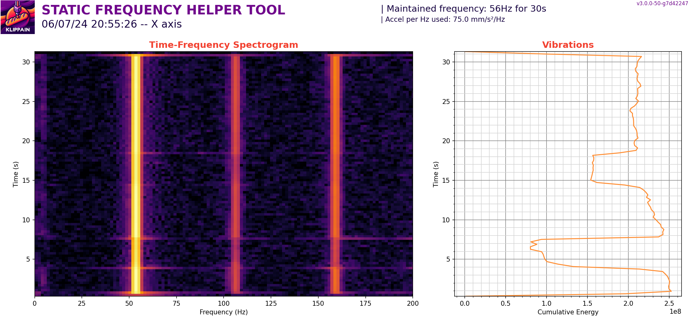

# Diagnosing problematic peaks

The `EXCITATE_AXIS_AT_FREQ` macro is particularly useful for troubleshooting mechanical vibrations or resonance issues. This macro allows you to maintain a specific excitation frequency for a set duration, enabling hands-on diagnostics.

## Usage

Here are the parameters available:

| parameters | default value | description |
|-----------:|---------------|-------------|
|CREATE_GRAPH|0|whether or not to record the accelerometer data and create an associated graph during the excitation|
|FREQUENCY|25|excitation frequency (in Hz) that you want to maintain. Usually, it's the frequency of a peak on one of the graphs|
|DURATION|30|duration in second to maintain this excitation|
|ACCEL_PER_HZ|None|accel per Hz value used for the test. If unset, it will use the value from your `[resonance_tester]` config section (75 is the default)|
|AXIS|x|axis you want to excitate. Can be set to either "x", "y", "a", "b"|
|TRAVEL_SPEED|120|speed in mm/s used for all the travel movements (to go to the start position prior to the test)|
|Z_HEIGHT|None|Z height wanted for the test. This value can be used if needed to override the Z value of the probe_point set in your `[resonance_tester]` config section|
|ACCEL_CHIP|None|accelerometer chip name from your Klipper config that you want to force for the test|

**By default, this macro does not generate a graph**, because by touching the various components of your machine with your fingers, you will dampen the vibrations and be able to easily identify those that are source of problems: touching them will stop the noise.

However, if you have something that is difficult to diagnose with your ears, or if you want to record your experiments or document the exact consequences and effects of your modifications with a more scientific approach, you can enable the creation of a graph. Just **keep in mind that since the accelerometer is usually mounted on the toolhead, the recording will correspond to the toolhead vibrations and not necessarily reflect another problematic component somewhere on the machine**, unless it's vibrating a lot and its vibrations are being transmitted up to the toolhead. So keep this in mind when looking at the graphs generated by this macro, and you may want to move the accelerometer to other locations to get a full overview.

### Spectrogram and vibrations harmonics

The time-frequency spectrogram visualizes how the frequency content of the signal changes over time. This plot helps identify dominant frequencies and harmonics of the excitated vibration. Each vertical line is one of them and a piece of the vibrations and noise that you can hear.

### Energy accumulation plot

The energy accumulation plot shows the cumulative energy over time, integrated over all frequencies. Basically, this plot is the sum of all the vibrations at a given moment during the test. So it can help you assess the periods of significant vibration and how much things change when you touch this or that part of the machine. In the example above, I vibrated my machine's X-axis at its main resonance frequency (i.e., its main resonance peak on the IS graphs) and touched 3 components:
  - From the 4th to the 8th second of the test, I touched the toolhead, which has the most vibration reduction because it's the main component vibrating at that frequency and touching it dampens it a lot.
  - From the 14th to the 18th second, I touched the belts and this reduced the vibration a bit, but not as much as touching the toolhead.
  - From the 23rd to the 27th second, I touched the left XY joint of my machine and it didn't have any noticeable effect on the vibrations.
  
But as mentioned above, **remember that this doesn't mean that the left XY joint doesn't contribute to the vibrations**. It means that its vibrations aren't causing a problem in the recorded toolhead vibrations (because the accelerometer was mounted on the toolhead!!!), but if you find that this actually also reduces the global noise to your ears, you may want to start a new recording by sticking the accelerometer directly on the XY joint (or the problematic component) instead to continue diagnosing.
