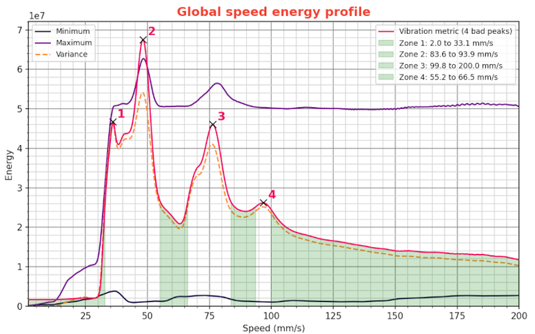
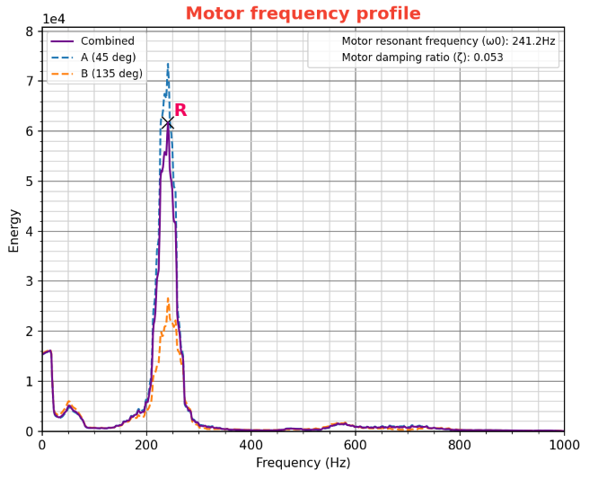

# Machine vibrations profiles

The `CREATE_VIBRATIONS_PROFILE` macro analyzes accelerometer data to plot the vibration profile of your 3D printer. The resulting graphs highlight optimal print speeds and angles that produce the least amount of vibration. It provides a technical basis for adjustments in your slicer profiles, but also in hardware setup and TMC driver parameters to improve print quality and reduce VFAs (vertical fines artifacts).

  > **Warning**
  >
  > You will need to calibrate the standard input shaper algorithms of Klipper using the other macros first! This test should be used as a last step to calibrate your printer with Shake&Tune.


## Usage

Call the `CREATE_VIBRATIONS_PROFILE` macro with the speed range you want to measure. Here are the parameters available:

| parameters | default value | description |
|-----------:|---------------|-------------|
|SIZE|100|maximum size in mm of the circle in which the recorded movements take place|
|Z_HEIGHT|20|z height to put the toolhead before starting the movements. Be careful, if your accelerometer is mounted under the nozzle, increase it to avoid crashing it on the bed of the machine|
|ACCEL|3000 (or max printer accel)|accel in mm/s^2 used for all moves. Try to keep it relatively low to avoid dynamic effects that alter the measurements, but high enough to achieve a constant speed for >~70% of the segments. 3000 is a reasonable default for most printers, unless you want to record at very high speed, in which case you will want to increase SIZE and decrease ACCEL a bit.|
|MAX_SPEED|200|maximum speed of the toolhead in mm/s to record for analysis|
|SPEED_INCREMENT|2|toolhead speed increments in mm/s between each movement|
|TRAVEL_SPEED|200|speed in mm/s used for all the travels moves|
|ACCEL_CHIP|"adxl345"|accelerometer chip name in the config|
|KEEP_N_RESULTS|3|Total number of results to keep in the result folder after running the test. The older results are automatically cleaned up|
|KEEP_CSV|0|Weither or not to keep the CSV data files alonside the PNG graphs (archived in a tarball)|


## Graphs description

The `CREATE_VIBRATIONS_PROFILE` macro results are constituted of a set of 6 plots. At the top of the figure you can also see all the detected motor, current and TMC driver parameters. These notes are just for reference in case you want to tinker with them and don't forget what you changed between each run of the macro.


### Global Speed Energy Profile

| Example | description |
|:-----|-------------|
||This plot shows the relationship between toolhead speed (mm/s) and vibrational energy, providing a global view of how speed impacts vibration across all movements. By using speeds from the green zones, your printer will run more smoothly and you will minimize vibrations and related fine artifacts in prints|

This graph is the most important one of this tool. You want to use it to adapt your slicer profile, especially by looking at the "vibration metric" curve, that will helps you find which speeds can be problematic for your printer. Here's the magic behind it, broken down into two key parts:
  1. **Spectrum Variance**: This is like the mood ring of your printer, showing how the vibes (a.k.a vibrations) change when printing from different angles. If the "vibration metric" is low, it means your printer is keeping its cool, staying consistent no matter the angle. But if it spikes, it's a sign that some angles are making your printer jitter more than a caffeinated squirrel. *Imagine it like this: You're looking for a chill party vibe where the music's good at every angle, not one where you turn a corner and suddenly it's too loud or too soft.*
  2. **Spectrum Max**: This one's about the max volume of the party, or how loud the strongest vibration is across all angles at any speed. We're aiming to avoid the speeds that crank up the volume too high, causing a resonance rave in the motors. *Think of it this way: You don't want the base so high that it feels like your heart's going to beat out of your chest. We're looking for a nice background level where everyone can chat and have a good time.*

And why do we care so much about finding these speeds? Because during a print, the toolhead will move in all directions depending on the geometry, and we want a speed that's like a good friend, reliable no matter what the situation. Fortunately, since the motors in our printers share their vibes without non-linear mixing and just add up (think of it as each doing its own dance without bumping into each other), we can find those happy green zones on the graph: these are the speeds that keep the vibe cool and the energy just right, making them perfect for all your print jobs.

### Polar Angle Energy Profile

| Example | description |
|:-----|-------------|
||Shows how vibrational energy varies with the direction where the toolhead is running. It helps in identifying angles that produce less vibration, and potentially detect assymetries in the belt paths for a CoreXY printer|

This plot is like your go-to playlist for finding those angles where the vibe is just right. But here's the thing: when printing, your toolhead will groove in all directions and angles, depending on the geometry of your parts, so sticking to just one angle isn't possible. My tip to make the most of this chart for your prints: if you're working on something rectangular, try to align it so that most of the edges match the angles that's least likely to make your printer jitter. For those sleek CoreXY printers, aiming for 45/135 degrees is usually a hit, while the trusty Cartesian printers groove best at 0/90 degrees. And for everything else? Well, there's not much more to do here except rely on the [Global Speed Energy Profile chart](#global-speed-energy-profile) to tune your slicer profile speeds instead.

Now, onto the symmetry indicator. Think of this tool as the dance coach for your printer, especially designed for those with a symmetrical setup like CoreXY models. It's all about using some pretty neat math (cross-correlation, to be exact) to check out the vibes from both sides of the dance floor. Picture it as a top-notch party dancer, scanning the room at every angle, judging each dancer, and only giving top marks when everyone is perfectly in sync. This tool is ace at catching any sneakiness in your motor control or belt path, highlighting any "butterfly" shapes or even the slightest variations in the motors' resonance patterns. It's like having a magnifying glass that points out exactly where the party fouls are, helping you to fix them and keep your prints rolling out smooth and stunning.

### Angular Speed Energy Profiles

| Example | description |
|:-----|-------------|
||Provides a detailed view of how energy distribution changes with speed for specific angles. It's useful for fine-tuning speeds for different directions of motion, or for tracking and diagnosing your printer's behavior across the major axes|

This chart is like a snapshot, capturing the vibe at certain angles of your printing party. But remember, it's just a glimpse into a few specific angles and doesn't fully reveal the whole dance floor where the toolhead moves in every direction, vibing with the unique geometry of your parts. So, think of it as a way to peek into how everyone's grooving in each corner of the party. It's great for a quick check-up to see how the vibe is holding up, but when it comes to setting the rhythm of your slicer speeds, you're going to want to use the [Global Speed Energy Profile chart](#global-speed-energy-profile) instead.

### Vibrations Heatmaps

| Example | description |
|:-----|-------------|
||Both plots provides a comprehensive overview of vibrational energy across speeds and angles. It visually identifies zones of high and low energy, aiding in the comprehensive understanding of the printer motors behavior. It's what is captured by the accelerometer and the base of all the other plots|

Both heatmaps lay down the vibe of vibrational energy across all speeds and angles, painting a picture of how the beat spreads throughout your printer's dance floor. The polar heatmap gives you a 360-degree whirl of the action, while the regular one lays it out in a classic 2D groove, yet both are vibing to the same tune and showing you where the energy's hot and popping and where it's cool and mellow across your printer's operational range. Think of it as the unique fingerprint of your motor's behavior captured by the accelerometer, it's the raw rhythm of your printer in action.

Because the scale is both normalized and logarithmic, you're looking for a heatmap (or spectrogram) that has a cool, consistent "orangish" vibe throughout, signaling not so much change over the spectrum with fairly low motor resonances. See areas in your heatmap that swing from deep purple/black to bright white/yellow? That's a sign that your printer motors are hitting high resonances at certain angles and speed combinations that are above the baseline vibrations outside of those areas. But remember, this is just the lay of the land, a snapshot of the scene: tweaking this vibe directly may not be easy, but you can still [play around with the TMC driver parameters](#improving-the-results) to adjust the beats and find a smoother rhythm.

### Motor Frequency Profile

| Example | description |
|:-----|-------------|
||Identifies the resonant frequencies of the motors and their damping ratios. Informative for now, but will be used later|

For now, this graph is purely informational and is a measurement of the motor's natural resonance profile. Think of this plot as a sneak peek at the inner workings of your printer's dance floor. It's not quite ready to hit the main stage for practical use, but just you wait... Keep an eye on this chart as it hints at future remixes where you'll get to play DJ and tweak and tune your printer's performance like never before.


## Improving the results

These graphs essentially depict the behavior of the motor control on your machine. While there isn't much room for easy adjustments to enhance them, most of you should only utilize them to configure your slicer profile to avoid problematic speeds.

However, if you want to go the rabbit hole, as the data in these graphs largely hinges on the type of motors, their physical characteristic and the way they are controlled by the TMC drivers black magic, there are opportunities for optimization. Tweaking TMC parameters allow to adjust the peaks, enhance machine performance, or diminish overall machine noise. For this process, I recommend to directly use the [Klipper TMC Autotune](https://github.com/andrewmcgr/klipper_tmc_autotune) plugin, which should simplify everything considerably. But keep in mind that it's still an experimental plugin and it's not perfect.

For individuals inclined to reach the bottom of the rabbit hole and that want to handle this manually, the use of an oscilloscope is mandatory. Majority of the necessary resources are available directly on the Trinamics TMC website:
  1. You should first consult the datasheet specific to your TMC model for guidance on parameter names and their respective uses.
  2. Then to tune the parameters, have a look at the application notes available on their platform, especially [AN001](https://www.trinamic.com/fileadmin/assets/Support/AppNotes/AN001-SpreadCycle.pdf), [AN002](https://www.trinamic.com/fileadmin/assets/Support/AppNotes/AN002-StallGuard2.pdf), [AN003](https://www.trinamic.com/fileadmin/assets/Support/AppNotes/AN003_-_DcStep_Basics_and_Wizard.pdf) and [AN009](https://www.trinamic.com/fileadmin/assets/Support/AppNotes/AN009_Tuning_coolStep.pdf).
  3. For a more comprehensive understanding, you might also want to explore [AN015](https://www.trinamic.com/fileadmin/assets/Support/AppNotes/AN015-StealthChop_Performance.pdf) and [AN021](https://www.trinamic.com/fileadmin/assets/Support/AppNotes/AN021-StealthChop_Performance_comparison_V1.12.pdf ), although they are more geared towards enhancing comprehension than calibration, akin to the TMC datasheet.

For reference, the default settings used in Klipper are:
```
#driver_TBL: 2
#driver_TOFF: 3
#driver_HEND: 0
#driver_HSTRT: 5
```
