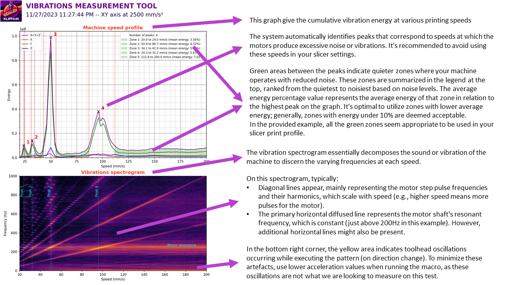
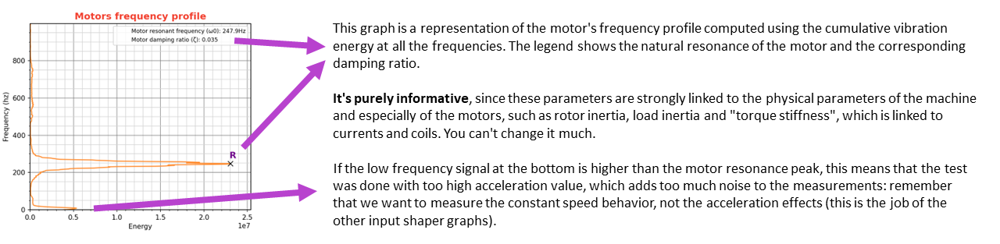
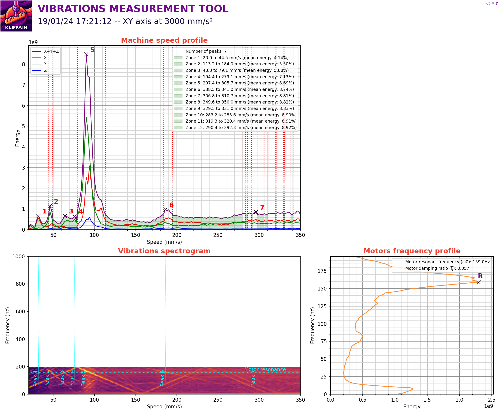

# Vibrations measurements

The `VIBRATIONS_CALIBRATION` macro helps you to identify the speed settings that exacerbate the vibrations of the machine (ie. where the frame and motors resonate badly). This will help you to find the clean speed ranges where the machine is more silent and less prone to vertical fine artifacts on the prints.

  > **Warning**
  >
  > You will first need to calibrate the standard input shaper algorithm of Klipper using the other macros! This test should not be used before as it would be useless and the results invalid.


## Usage

Call the `VIBRATIONS_CALIBRATION` macro with the direction and speed range you want to measure. Here are the parameters available:

| parameters | default value | description |
|-----------:|---------------|-------------|
|SIZE|60|size in mm of the area where the movements are done|
|DIRECTION|"XY"|direction vector where you want to do the measurements. Can be set to either "XY", "AB", "ABXY", "A", "B", "X", "Y", "Z", "E"|
|Z_HEIGHT|20|z height to put the toolhead before starting the movements. Be careful, if your accelerometer is mounted under the nozzle, increase it to avoid crashing it on the bed of the machine|
|ACCEL|3000 (or max printer accel)|accel in mm/s^2 used for all the moves. Try to keep it relatively low to avoid bad oscillations that affect the measurements, but but high enough to reach constant speed for >~70% of the segments|
|MIN_SPEED|20|minimum speed of the toolhead in mm/s for the movements|
|MAX_SPEED|200|maximum speed of the toolhead in mm/s for the movements|
|SPEED_INCREMENT|2|speed increments of the toolhead in mm/s between every movements|
|TRAVEL_SPEED|200|speed in mm/s used for all the travels moves|
|ACCEL_CHIP|"adxl345"|accelerometer chip name in the config|
|KEEP_N_RESULTS|3|Total number of results to keep in the result folder after running the test. The older results are automatically cleaned up|
|KEEP_CSV|True|Weither or not to keep the CSV data files alonside the PNG graphs (archived in a tarball)|


## Graphs description




## Improving the results

These graphs essentially depict the behavior of the motor control on your machine. While there isn't much room for easy adjustments to enhance them, most of you should only utilize them to configure your slicer profile to avoid problematic speeds.

However, if you want to go the rabbit hole, as the data in these graphs largely hinges on the type of motors, their physical characteristic and the way they are controlled by the TMC drivers black magic, there are opportunities for optimization. Tweaking TMC parameters allow to adjust the peaks, enhance machine performance, or diminish overall machine noise. For this process, I recommend to directly use the [Klipper TMC Autotune](https://github.com/andrewmcgr/klipper_tmc_autotune) plugin, which should simplify everything considerably. But keep in mind that it's still an experimental plugin and it's not perfect.

For individuals inclined to reach the bottom of the rabbit hole and that want to handle this manually, the use of an oscilloscope is mandatory. Majority of the necessary resources are available directly on the Trinamics TMC website:
  1. You should first consult the datasheet specific to your TMC model for guidance on parameter names and their respective uses.
  2. Then to tune the parameters, have a look at the application notes available on their platform, especially [AN001](https://www.trinamic.com/fileadmin/assets/Support/AppNotes/AN001-SpreadCycle.pdf), [AN002](https://www.trinamic.com/fileadmin/assets/Support/AppNotes/AN002-StallGuard2.pdf), [AN003](https://www.trinamic.com/fileadmin/assets/Support/AppNotes/AN003_-_DcStep_Basics_and_Wizard.pdf) and [AN009](https://www.trinamic.com/fileadmin/assets/Support/AppNotes/AN009_Tuning_coolStep.pdf).
  3. For a more comprehensive understanding, you might also want to explore [AN015](https://www.trinamic.com/fileadmin/assets/Support/AppNotes/AN015-StealthChop_Performance.pdf) and [AN021](https://www.trinamic.com/fileadmin/assets/Support/AppNotes/AN021-StealthChop_Performance_comparison_V1.12.pdf ), although they are more geared towards enhancing comprehension than calibration, akin to the TMC datasheet.

For reference, the default settings used in Klipper are:
```
#driver_TBL: 2
#driver_TOFF: 3
#driver_HEND: 0
#driver_HSTRT: 5
```

### Semi-blank spectrogram (LIS2DW)

The integration of LIS2DW as a resonance measuring device in Klipper is becoming more and more common, especially because some manufacturers are promoting its superiority over the established ADXL345. It's indeed a new generation chip that should be better to measure traditional "accelerations". However, a detailed comparison of their datasheets and practical measurements paints a more complex picture: the LIS2DW boasts greater sensitivity, but it has a lower sampling rate and produce significant aliasing.

This lower sampling rate is problematic for the vibration graph because it only records data up to 200 Hz, which is too low to produce an accurate graph. This will be seen as a small low frequency band on the spectrogram with a blank area for higher frequencies and incorrect data printed in the speed profile and motor frequency profile.

| LIS2DW vibration measurement |
| --- |
|  |
